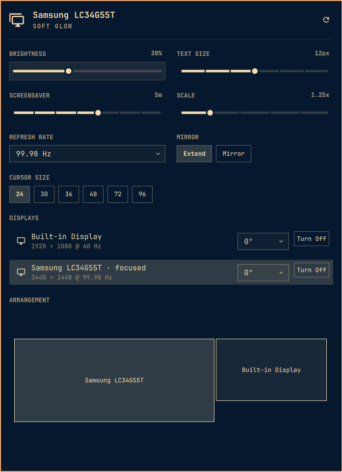

# Monitor Settings Extender

An [Omarchy](https://omarchy.org/) shell plugin that extends the stock **Display** bar widget with the monitor controls it's missing — refresh rate, mirror/extend, per-display rotation, cursor size, and a draggable arrangement diagram for multi-monitor layouts.

It's a drop-in replacement: installing it with `--enable` swaps it in for the built-in Display widget in your bar automatically, in the same spot, no manual reconfiguration needed.



## Why

This started as a screen-flickering fix, not a feature request. My external monitor was flickering at its default 165Hz — the display link couldn't reliably sustain that rate — and dropping to 99.98Hz fixed it. Fixing it meant hand-editing `~/.config/hypr/monitors.lua` and running `hyprctl`, since the stock Display widget has no refresh rate control at all.

Once I was already in there, the same gap showed up elsewhere — rotation, arranging multiple monitors, cursor size — all `hyprctl`-and-hope-you-remember-the-syntax instead of something in the same panel as brightness and scale, which is all the stock widget covers. This plugin extends that panel to cover the rest, and it's built for any number of displays, not just two — though I've only tested it against my own two-monitor setup.

## Features

- **Two-column settings grid** — brightness, text size, scale, refresh rate, mirror/extend, cursor size, screensaver timeout, and displays, laid out to use the panel's width instead of one long list.
- **Friendly display names** — "Samsung LC34G55T" and "Built-in Display" instead of `DP-7` and `eDP-1`, built from EDID make/model rather than the raw connector name (which can silently renumber when a dock re-links).
- **Refresh rate dropdown** — every rate the focused display actually advertises at its current resolution, applied live.
- **Mirror / Extend** — toggle for laptop + external display setups.
- **Per-display rotation** — a dropdown right in the Displays list, 0°/90°/180°/270°, applied without disturbing the display's position.
- **Cursor size** — sized to the active cursor theme's actual raster steps (so every option is visually distinct, not just a fixed 16/24/32/48/64/96 guess), correctly compensated for the display's scale factor so the physical size stays consistent.
- **Screensaver idle timeout** — a slider up to 30 minutes, independent of the lock timeout.
- **Draggable arrangement diagram** — a proportional floor-plan of your enabled displays. Drag one anywhere; edges and centers snap to neighbors within a small threshold. Displays can never end up overlapping — resolved automatically on drop, and self-healed on every refresh regardless of what caused it (including Hyprland's own "auto" placement, which isn't always collision-free on its own).
- **Turn Off / Turn On** per display, as an explicit button rather than an implicit click-anywhere row.
- **Restart Omarchy Shell** — a small action button in the panel header, for when a plugin/config change needs a reload.
- **Auto-reopens itself** after an action that forces the panel closed (some monitor changes make Hyprland notify clients of a geometry change, which can close the popup as a side effect) — whether that closed just this popup or restarted the whole shell.

## Requirements

- [Omarchy](https://omarchy.org/) — this plugin uses Omarchy's own CLI helpers (`omarchy-hyprland-monitor-scaling`, `omarchy-hyprland-monitor-internal-mirror`, `omarchy-monitor-state`, `omarchy-osd`) and its Lua-based Hyprland config layer (`hl.monitor(...)`, via `hyprctl eval`). It will not work on a plain Hyprland setup without Omarchy.
- `jq` and `gsettings` (both present on a stock Omarchy install).

## Install

```sh
omarchy plugin add https://github.com/juliusmork-sys/Omarchy-Monitor-Settings-Extender.git --enable
```

If you still have the stock Display widget in your bar, `--enable` replaces it in place automatically. If you don't (e.g. you'd removed it), it's added to the right section of the bar by default — move it with `omarchy bar move io.github.juliusmork-sys.monitor-settings-extender --section <left|center|right>` if you'd rather it lived elsewhere.

⚠️ Like any Omarchy shell plugin, this runs as unsandboxed code inside your long-lived `omarchy-shell` process. Read through `Panel.qml`/`Model.js` before installing if that matters to you.

## Uninstall

```sh
omarchy plugin remove io.github.juliusmork-sys.monitor-settings-extender
```

This disables the plugin before deleting it, which restores the stock Display widget to its original spot in your bar automatically — no manual bar reconfiguration needed either way.

## Known limitations

- The arrangement diagram supports free 2D placement, but doesn't currently support portrait-monitor-aware auto-layout suggestions — you position everything by hand.
- Cursor size is a single global Hyprland/GTK setting; on a multi-monitor setup with different scale factors, the plugin compensates for the *focused* display's scale when computing the logical size to send, not each display independently (a Wayland/Hyprland limitation, not something this plugin can fully work around).
- Primary-display selection isn't included — Hyprland has no native concept of one, so it was cut rather than shipped as a no-op preference.

## License

MIT — see [LICENSE](LICENSE).
